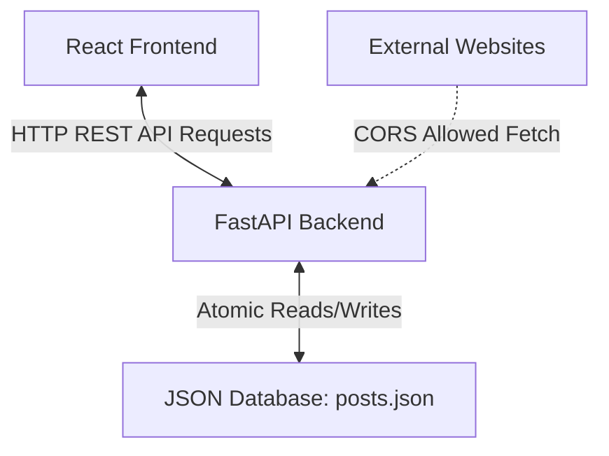

# Project Flow - Post & Get Feed Dashboard

This document explains the architecture, layout, and step-by-step data flow of the project in a simple, easy-to-understand way.

---

## 1. System Architecture

The project consists of three main building blocks:

1. **Frontend (React + Vite)**: A premium glassmorphic user interface. It is divided into two tabs: **Dashboard** and **Community Feed**.
2. **Backend (FastAPI)**: A high-performance Python server. It provides API endpoints, verifies tokens, and handles database operations.
3. **Database (posts.json)**: A local file database that stores all post records. It seeds **10,000 mock items** automatically on initial startup.

---

## 2. Key Components & Layouts

### Dashboard Tab
- **Stats Counter**: Displays total posts (10,000), total likes, and active unique author counts.
- **Security Session Card**: Used to manage access. You can input tokens manually or click **Generate Key** to request a random token from the backend.
- **Developer API Hub**: Contains copyable endpoints and copyable JavaScript `fetch` code blocks. This lets you load and write posts from **any other website** (thanks to global CORS headers allowed on the backend).
- **Post Form**: A clean widget to publish new posts.

### Community Feed Tab
- **Search Bar**: Lets you search title, content, or authors across all 10,000 posts.
- **Category Filter & My Likes**: Select pills to filter posts by Tech, Idea, Life, General, or **My Likes** (shows only the posts you liked in your active session).
- **Grid Layout**: Displays post cards with cover headers and a row of screenshot thumbnails.
- **Smart Numbered Pagination**: Splits 10,000 posts into pages of **12 items each** (834 pages total), using collapsing dots (`...`) for clean navigation.

---

## 3. Step-by-Step Data Flow

### A. Initial Load Flow
1. The user opens the web page (`http://localhost:5173`).
2. The React frontend sends a `GET` request to `http://localhost:8000/v1/api/get_posts`.
3. The FastAPI backend receives the request:
   - It reads `backend/posts.json`.
   - If the file is missing or contains old mock data, it seeds **10,000 new photo posts**.
   - It returns the sorted list of posts to the frontend.
4. The frontend updates its state, calculates metrics (total posts, total likes), and displays them.

### B. Publishing a New Post
1. The user fills out the form on the Dashboard and clicks **Publish**.
2. The frontend sends a `POST` request to `http://localhost:8000/v1/api/create_posts` containing:
   - JSON payload: `{ title, author, content, category, medium_cover_image }`
   - Authorization Header: `Bearer [session_token]`
3. The backend verifies the token:
   - If valid: it creates the post, assigns a new ID, appends it to `posts.json`, writes the file to disk, and sends back the new post object.
   - If invalid: it returns a `401 Unauthorized` error.
4. If successful, the frontend appends the new post to its state, flashes a success notification toast, and redirects to the **Community Feed** tab.

### C. Liking a Post
1. The user clicks the **Heart** button on a card in the feed.
2. The frontend sends a `POST` request to `/v1/api/like_post/{id}` with the Bearer token.
3. The backend increments the like counter, writes the change to `posts.json`, and returns the updated post.
4. The frontend updates the like counter for that card and adds the post to the local **My Likes** session list.

### D. External Integration (Developer Hub)
1. You copy the JavaScript fetch code block from the Developer API Hub.
2. You paste that script into the code of **any other website** (e.g. a separate blog, portfolio, or blank page).
3. Because the backend has `CORSMiddleware` configured to allow all origins (`*`), the external site is able to query your FastAPI server and display your feed data directly!
