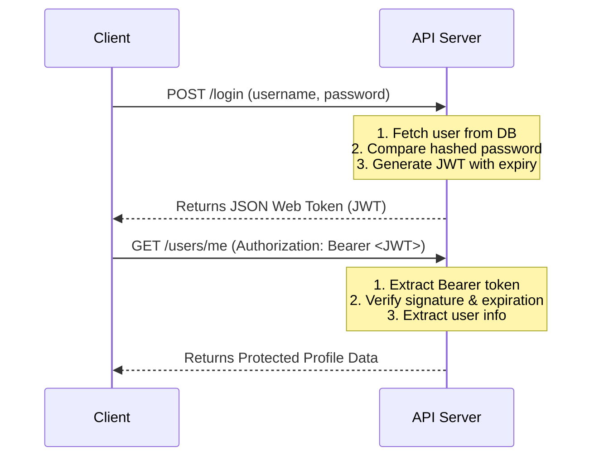

# Module 07: Authentication & Security 🔐

In this module, you will learn how to secure your APIs. We will cover how to hash passwords securely (never store plain text passwords!) and how to authenticate users using **JSON Web Tokens (JWT)**.

---

## 📚 Topics Covered

1. **Password Hashing (bcrypt / passlib)**: Cryptographically hashing passwords to store them safely. Even if your database gets hacked, attackers cannot read the original passwords.
2. **JSON Web Tokens (JWT)**: A secure method for representing claims between two parties.
   - **Header**: Defines the token type (JWT) and signing algorithm (HS256).
   - **Payload**: Contains claims (user information like user ID, username, role, and expiration timestamp).
   - **Signature**: Used to verify the token was not tampered with.
3. **Bearer Token Authentication**: Sending JWTs in the HTTP `Authorization` header as `Bearer <token>`.
4. **FastAPI Security Utilities**: Utilizing `OAuth2PasswordBearer` to extract tokens automatically from request headers and protect endpoints.

---

## 🗂️ Files in this Module

- `auth_demo.py`: A self-contained, working FastAPI app demonstrating password registration, login, token generation, and secure route protection. Run it using:
  ```bash
  uvicorn auth_demo:app --reload --port 8000
  ```
- `challenge.py`: A coding exercise challenging you to implement token expiration validation and password verification functions. Run it using:
  ```bash
  python challenge.py
  ```

---

## 🔒 JWT Workflow Diagram


